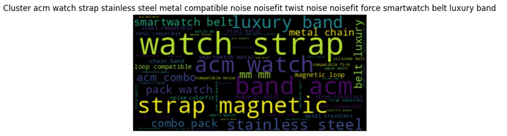

# Product-Categorization

Observations and analysis:
A brand can have multiple products like laptops and mobiles - So brand can't be only feature to determine
There are brand names like 0, 168, NA etc..
Title is summarized texts containing brandname as well. So this feature is good.

## Data Cleaning and Processing

Data_Clean.csv - Pre-Processed text with title and thumbnail
Stop words, punctuations, lower case etc.

## Topic Modelling

### LDA Sklearn
sklearn - CountVectorizer as features. 
LDA - for Dimensionality Reduction

features:
title (clean) and countervectorizer . Taking description can also improve the performance due to addition of lot of contexts.

Results:
topic distribution after clustering
| Topic Index | Count |
| --- | --- |
| 0 | 7433 |
| 1 | 6360 |
| 2 | 19780 |
| 3 | 9971 |
| 4 | 28693 |
| 5 | 11064 |

PylDAvis:


Above shows clear distinction of 6 clusters which is good topic model.

Output:
Topic: 0 \
  bag, laptop, type, warranty, windows \
Topic: 1 \
  flip, phone, card, wallet, mobile \
Topic: 2 \
  compatible, watch, galaxy, leather, samsung \
Topic: 3 \
  iphone, watch, smart, women, bluetooth \
Topic: 4 \
  case, cover, charger, pro, charging \
Topic: 5 \
  vivo, inch, display, laptop, intel \

By above it can be seen clearly that 
```python
### Labelling Results - For LDA
    map_to_output = {0:"Laptop",1:"Others",2:"Printers",3:"Smartwatch", 4:"Mobile",5:"Desktop"}
```

### Improvements
Can use tfidf features as well to improve the performance

### Sentence tranformers with Kmeans Clustering
Sentence tranformers for creating doc embeddings \
Kmeans for creating clusters 

features:
title (clean) is taken as a feature. Taking description can also improve the performance due to addition of lot of contexts.

Result:
topic distribution after clustering \
| Topic Index | Count |
| --- | --- |
| 1 | 11046 |
| 2 | 15911 |
| 3 | 23072 |
| 4 | 16569 |
| 5 | 9279 |
| 6 | 7424 |

WordClouds: \
cluster 1


cluster 2


cluster 3


cluster 4


cluster 5


cluster 6


output: 
```python
### Labelling Results - For Kmeans
    map_to_output = {0:"Mobile",1:"Printer",2:"Desktop",3:"Smartwatch", 4:"Others",5:"Laptop"}
```

Thus Both of the above is good a topic model having clear distinction.

### Improvements
USE image as well for creating label using VIT tranformer   
Can take description as well for labelling 

## Product Multiclassification using BERT model

### Experiment 1 - (LDA Data, Trained with 50% of labelled data)

Evaluation Metric:
F1-Score as data is imbalanced

Training:\ 
Epoch 1 \
Training loss: 0.20996832987158887 \
Validation loss: 0.31821184134476377 \
F1 Score (Weighted): 0.9020082201038174 \

Epoch 2 \
Training loss: 0.2120044876928212 \ 
Validation loss: 0.28195449785616633 \
F1 Score (Weighted): 0.9074309908181265 \
...
...

Results and evaluation on Validation Data: \
Class: 0
Accuracy: 454/536

Class: 1
Accuracy: 384/459

Class: 2
Accuracy: 1305/1431

Class: 3
Accuracy: 677/714

Class: 4
Accuracy: 1967/2060

Class: 5
Accuracy: 719/800

F1-SCORE: 90%

### Experiment 2 - (Kmeans Data, Trained with 50% of labelled data)

Data classes distribution: \
| Label | Data Type | Train | Val |
| --- | --- | --- | --- |
| 0 | train | 4505 | 795 |
| 0 | val |  |  |
| 1 | train | 6548 | 1156 |
| 1 | val |  |  |
| 2 | train | 9439 | 1665 |
| 2 | val |  |  |
| 3 | train | 6739 | 1189 |
| 3 | val |  |  |
| 4 | train | 3761 | 664 |
| 4 | val |  |  |
| 5 | train | 3008 | 531 |
| 5 | val |  |  |

Evaluation Metric:
Imbalanced data can handled by choosing correct evaluation metric which is Precision, Recall and F-Score

Training: \
Epoch 1 \
Training loss: 0.18195189569042058 \
Validation loss: 0.07974208040073752 \
F1 Score (Weighted): 0.9773530337741395 \

Epoch 2 \
Training loss: 0.056020494600515267 \
Validation loss: 0.07013297464792675 \
F1 Score (Weighted): 0.9810772920329817 \

Epoch 3 \
Training loss: 0.03608494108226956 \
Validation loss: 0.07039217839755633 \
F1 Score (Weighted): 0.9826290609313495 \
...
...

Results and evaluation:

Class: 0
Accuracy: 785/795

Class: 1
Accuracy: 1140/1156

Class: 2
Accuracy: 1651/1665

Class: 3
Accuracy: 1162/1189

Class: 4
Accuracy: 631/664

Class: 5
Accuracy: 495/531

F1-SCORE: 97%

Improvements: \
Might be overfitted but can be tackled by dropout and regularization - Didn't get time to fix that but can be improved in next iteration
Increase the data for training 

## Usage
API Service:
running the server
```bash
uvicorn main:app --host 0.0.0.0 --port 8000
```

Change the data present in test.py
```python
data = '{"title": "Xiaomi 11i 5G Hypercharge (Stealth Black, 6GB RAM, 128GB Storage)", "thumbnail": "https://m.media-amazon.com/images/I/71BQ8Kjt29L._SL1500_.jpg"}'
```

for testing ,run test.py with passed data json
```bash
python test.py
```

for choosing model - BERT_LDA or BERT_Kmeans
``` python
model.load_state_dict(torch.load('checkpoints/finetuned_BERT_Kmeans_epoch.model', map_location=torch.device('cpu')))
```

for mapping
```python
### Labelling Results - For Kmeans
    map_to_output = {0:"Mobile",1:"Printer",2:"Desktop",3:"Smartwatch", 4:"Others",5:"Laptop"}
```

## Final Results 
BERT_LDA

```bash
C:\Users\vaibh\OneDrive\Desktop\Product-Categorization>python test.py
Request successful!
{'title': 'Xiaomi 11i 5G Hypercharge (Stealth Black, 6GB RAM, 128GB Storage)', 'Thumbnail': 'https://m.media-amazon.com/images/I/71BQ8Kjt29L._SL1500_.jpg', 'product_type': 'Mobile', 'Product_Type_conf_score': 0.7956177592277527, 'Other_Possible_Product_Type': {'Laptop': 0.015701234340667725, 'Others': 0.001399507513269782, 'Printers': 0.0022549154236912727, 'Smartwatch': 0.001993010751903057, 'Mobile': 0.7956177592277527, 'Desktop': 0.1830335259437561}}
```

BERT_Kmeans
```bash
Request successful!
{'title': 'Xiaomi 11i 5G Hypercharge (Stealth Black, 6GB RAM, 128GB Storage)', 'Thumbnail': 'https://m.media-amazon.com/images/I/71BQ8Kjt29L._SL1500_.jpg', 'product_type': 'Mobile', 'Product_Type_conf_score': 0.9942101240158081, 'Other_Possible_Product_Type': {'Mobile': 0.9942101240158081, 'Printer': 0.0004031399730592966, 'Desktop': 0.0006456150440499187, 'Smartwatch': 0.0011665192432701588, 'Others': 0.0009345235885120928, 'Laptop': 0.0026401979848742485}}
```

# NER - Attribute Tagger

## MOBILE

Results:
=========================== Initializing pipeline ===========================
✔ Initialized pipeline

============================= Training pipeline =============================
ℹ Pipeline: ['tok2vec', 'ner']
ℹ Initial learn rate: 0.001
| Epoch | Step | LOSS TOK2VEC | LOSS NER | ENTS_F | ENTS_P | ENTS_R | SCORE |
| --- | --- | --- | --- | --- | --- | --- | --- |
| 0 | 0 | 0.00 | 106.69 | 0.00 | 0.00 | 0.00 | 0.00 |
| 0 | 200 | 414.20 | 4348.63 | 44.95 | 58.20 | 36.61 | 0.45 |
| 0 | 400 | 328.51 | 2794.96 | 41.46 | 47.00 | 37.09 | 0.41 |
| 0 | 600 | 58.27 | 3250.15 | 41.52 | 45.59 | 38.13 | 0.42 |
| 0 | 800 | 55.10 | 3031.42 | 52.04 | 49.57 | 54.78 | 0.52 |
| 1 | 1000 | 60.28 | 3333.52 | 39.04 | 36.83 | 41.53 | 0.39 |
| 1 | 1200 | 94.13 | 4071.16 | 54.20 | 50.66 | 58.28 | 0.54 |
| 2 | 1400 | 82.30 | 4359.56 | 52.53 | 49.46 | 56.01 | 0.53 |
| 2 | 1600 | 89.31 | 4853.72 | 60.34 | 55.03 | 66.79 | 0.60 |
| 3 | 1800 | 118.10 | 5541.28 | 52.31 | 50.13 | 54.68 | 0.52 |
| 3 | 2000 | 165.50 | 6147.18 | 54.29 | 51.17 | 57.81 | 0.54 |
| 4 | 2200 | 140.11 | 7054.81 | 59.93 | 58.78 | 61.12 | 0.60 |
| 5 | 2400 | 301.09 | 7902.63 | 61.24 | 57.01 | 66.13 | 0.61 |
| ... | ... | ... | ... | ... | ... | ... | ... |
| 13 | 3800 | 312.74 | 9729.62 | 60.84 | 56.06 | 66.51 | 0.61 |
| 15 | 4000 | 361.47 | 9526.00 | 57.64 | 58.95 | 56.39 | 0.58 |


testing:
text = "EL D68 (Green, 32 GB) 3 GB RAM ['3 GB RAM | 32 GB ROM | Expandable Upto 128 GB', '15.46 cm (6.088 inch) Display', '13MP Rear Camera | 8MP Front Camera', '4000 mAh Battery', 'Quad-Core Processor']"

Green   ->>>>   COLOR \
32 GB   ->>>>   STORAGE \
3 GB RAM   ->>>>   RAM \
3 GB RAM   ->>>>   RAM \
32 GB ROM   ->>>>   STORAGE \
Expandable Upto 128 GB   ->>>>   EXPANDABLE_STORAGE \
15.46 cm (6.088 inch)   ->>>>   SCREEN_SIZE \
13MP Rear Camera   ->>>>   BACK_CAMERA \
8MP Front Camera   ->>>>   FRONT_CAMERA \
4000 mAh Battery   ->>>>   BATTERY_CAPACITY \
Quad-Core Processor   ->>>>   PROCESSOR_CORE \

Final Output:

And final result stored in raining Data/Mobile/Final_Result_Mobile.csv

```python

### Testing
def test(text):
  # Load the trained spaCy NER model from the specified path
  nlp = spacy.load("Training Data/Mobile/output/model-best")

  #text = "EL D68 (Green, 32 GB) 3 GB RAM ['3 GB RAM | 32 GB ROM | Expandable Upto 128 GB', '15.46 cm (6.088 inch) Display', '13MP Rear Camera | 8MP Front Camera', '4000 mAh Battery', 'Quad-Core Processor']"
  docs = nlp(text)
  attributes = {}
  for ent in docs.ents:
    # Print the recognized text and its corresponding label
    attributes[ent.label_] = ent.text
  return attributes

```

## LAPTOP 

Results:
=========================== Initializing pipeline ===========================
✔ Initialized pipeline

============================= Training pipeline =============================
ℹ Pipeline: ['tok2vec', 'ner']
ℹ Initial learn rate: 0.001
| Epoch | Step | LOSS TOK2VEC | LOSS NER | ENTS_F | ENTS_P | ENTS_R | SCORE |
| --- | --- | --- | --- | --- | --- | --- | --- |
| 0 | 0 | 0.00 | 40.36 | 0.00 | 0.00 | 0.00 | 0.00 |
| 4 | 200 | 88.38 | 1605.06 | 48.15 | 43.33 | 54.17 | 0.48 |
| 8 | 400 | 23.58 | 439.22 | 59.26 | 53.33 | 66.67 | 0.59 |
| 14 | 600 | 104.49 | 289.68 | 61.90 | 72.22 | 54.17 | 0.62 |
| 20 | 800 | 39.03 | 196.97 | 65.22 | 68.18 | 62.50 | 0.65 |
| 27 | 1000 | 48.17 | 170.84 | 60.00 | 75.00 | 50.00 | 0.60 |
| 34 | 1200 | 31.62 | 165.31 | 69.77 | 78.95 | 62.50 | 0.70 |
| 42 | 1400 | 65.98 | 204.34 | 69.39 | 68.00 | 70.83 | 0.69 |
| 53 | 1600 | 36.93 | 173.93 | 72.73 | 80.00 | 66.67 | 0.73 |
| 64 | 1800 | 118.11 | 220.46 | 71.11 | 76.19 | 66.67 | 0.71 |
| 79 | 2000 | 75.25 | 231.58 | 76.60 | 78.26 | 75.00 | 0.77 |
| 97 | 2200 | 40.05 | 248.59 | 69.23 | 64.29 | 75.00 | 0.69 |
| 120 | 2400 | 29.12 | 277.95 | 66.67 | 66.67 | 66.67 | 0.67 |
| 148 | 2600 | 109.15 | 354.39 | 75.00 | 75.00 | 75.00 | 0.75 |
| ... | ... | ... | ... | ... | ... | ... | ... |
| 375 | 4200 | 193.09 | 403.85 | 73.47 | 72.00 | 75.00 | 0.73 |
| 404 | 4400 | 20.85 | 320.89 | 72.00 | 69.23 | 75.00 | 0.72 |

✔ Saved pipeline to output directory
Training Data\Laptop\output\model-last
✔ Saved pipeline to output directory

Testing:
text "ASUS FX506LHB-HN355W i5 10300H\/ GTX1650- 4GB\/ 8G\/ 512G SSD\/ 15.6 FHD-144hz\/ Backlit KB- 1 Zone RGB\/ 48Whr\/ Win 11\/ \/ \/ McAfee(1 Year)\/ 1B-Black Plastic" \

ASUS FX506LHB-HN355W i5   ->>>>   PROCESSOR \
8G\/ 512   ->>>>   RAM \

Final Output:

And final result stored in raining Data/Laptop/Final_Result_Laptop.csv

## Improvements
More data required - Span is giving NONE - this producing only around 100 data points And remaining 350 is not included which is still less \
learining rate and epochs can be improved 
