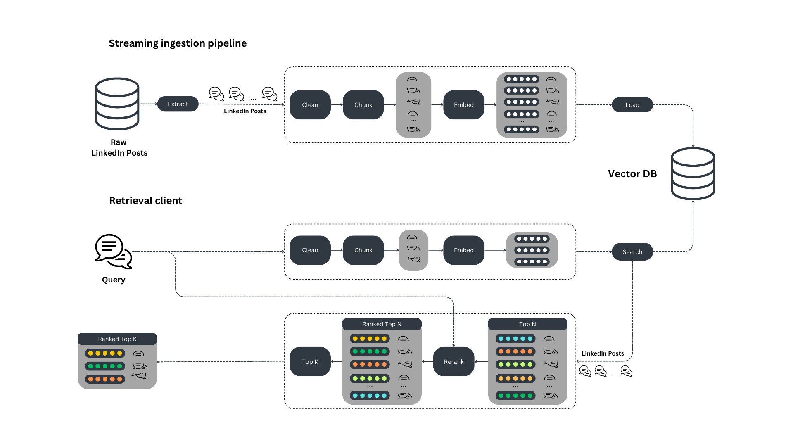

## Real-Time RAG Production pipeline for Documents



## Steps to Follow

1. Install project dependencies using Poetry:
    ```bash
    poetry install
    ```

2. Activate the virtual environment created by Poetry:
    ```bash
    poetry shell
    ```

3. Replace the JSON file with the PDF in `test.py`:
    ```python
    stream = op.input("input", flow, JSONSource(["Veritus_RAG/rag/data/JSON/Book_TextHeavy.json"]))
    ```

4. Run the `test.py` script:
    ```bash
    python test.py
    ```

5. Edit the `query_question` variable in `output.py` to specify your question:
    ```python
    query_question = "Who is Eric Berne?"
    ```

6. Run the `output.py` script to generate the final output:
    ```bash
    python output.py
    ```

After following these steps, you should have your final output ready based on the specified query.
